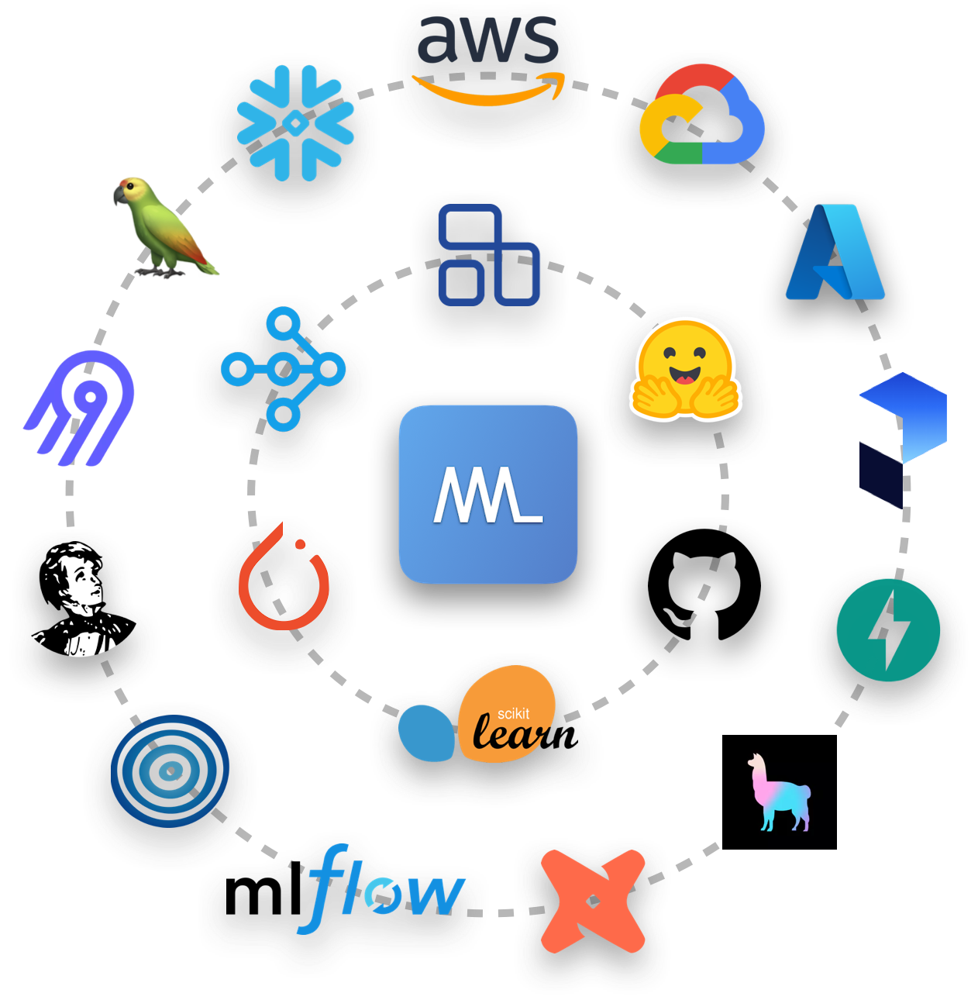



<!-- Hero -->
<div class="row flex-column-reverse flex-md-row">
    <div class="col-md-7">
        <div class="ai-hero-text">
            <h1 style="margin-bottom: 0rem; color: #000; font-weight: 500;">Made With ML</h1>
            <p style="margin-top: 0rem; margin-bottom: 0rem !important; color: #807e7e;">Applied ML · MLOps · Production</p>
            <p style="font-size: 0.89rem;">Join <b>20K+ developers</b> in learning how to <a href="about">responsibly</a> deliver value with applied ML.</p>
            <div id="revue-embed">
                <form action="https://www.getrevue.co/profile/mwml/add_subscriber" method="post" id="revue-form" name="revue-form"  target="_blank">
                    <input class="revue-form-field" placeholder="Your email address..." type="email" name="member[email]" id="member_email" style="width: 80%; border: 1px solid #b3b3b3; border-radius: 3px;">
                    <button class="md-button md-button--purple-gradient mr-2 mb-2 mb-md-0 mt-md-2 mt-2" type="submit" style="cursor: pointer !important;">
                        <span class="twemoji mr-1"><svg xmlns="http://www.w3.org/2000/svg" viewBox="0 0 24 24"><path fill-rule="evenodd" d="M1.75 3A1.75 1.75 0 000 4.75v14c0 .966.784 1.75 1.75 1.75h20.5A1.75 1.75 0 0024 18.75v-14A1.75 1.75 0 0022.25 3H1.75zM1.5 4.75a.25.25 0 01.25-.25h20.5a.25.25 0 01.25.25v.852l-10.36 7a.25.25 0 01-.28 0l-10.36-7V4.75zm0 2.662V18.75c0 .138.112.25.25.25h20.5a.25.25 0 00.25-.25V7.412l-9.52 6.433c-.592.4-1.368.4-1.96 0L1.5 7.412z"></path></svg></span> Subscribe</button>
                        <a href="#ml-foundations"><span class="md-button md-button--grey-secondary mr-2 mb-2 mb-md-0 mt-md-2 px-3 py-1">View courses</span></a>
                </form>
            </div>
        </div>
    </div>
    <div class="col-md-5 ai-center-all">
        <div class="mb-md-0 mb-4">
            <a href="#applied-ml"></a>
        </div>
    </div>
</div>

<hr>

<!-- Features -->
## Features
<div class="row ai-features">
    <div class="col-md-6 ai-feature">
        <div class="ai-feature-header">
            <span class="twemoji"><svg xmlns="http://www.w3.org/2000/svg" viewBox="0 0 24 24"><path fill-rule="evenodd" d="M12 2.5c-3.81 0-6.5 2.743-6.5 6.119 0 1.536.632 2.572 1.425 3.56.172.215.347.422.527.635l.096.112c.21.25.427.508.63.774.404.531.783 1.128.995 1.834a.75.75 0 01-1.436.432c-.138-.46-.397-.89-.753-1.357a18.354 18.354 0 00-.582-.714l-.092-.11c-.18-.212-.37-.436-.555-.667C4.87 12.016 4 10.651 4 8.618 4 4.363 7.415 1 12 1s8 3.362 8 7.619c0 2.032-.87 3.397-1.755 4.5-.185.23-.375.454-.555.667l-.092.109c-.21.248-.405.481-.582.714-.356.467-.615.898-.753 1.357a.75.75 0 01-1.437-.432c.213-.706.592-1.303.997-1.834.202-.266.419-.524.63-.774l.095-.112c.18-.213.355-.42.527-.634.793-.99 1.425-2.025 1.425-3.561C18.5 5.243 15.81 2.5 12 2.5zM9.5 21.75a.75.75 0 01.75-.75h3.5a.75.75 0 010 1.5h-3.5a.75.75 0 01-.75-.75zM8.75 18a.75.75 0 000 1.5h6.5a.75.75 0 000-1.5h-6.5z"></path></svg></span>
            Intuition-first
        </div>
        <div class="ai-feature-text">
            We'll never jump straight to code, instead we'll develop an intuition for the concepts first.
        </div>
    </div>
    <div class="col-md-6 ai-feature">
        <div class="ai-feature-header">
            <span class="twemoji"><svg xmlns="http://www.w3.org/2000/svg" viewBox="0 0 24 24"><path fill-rule="evenodd" d="M8 8.807V3.5h-.563a.75.75 0 010-1.5h9.125a.75.75 0 010 1.5H16v5.307l5.125 9.301c.964 1.75-.302 3.892-2.299 3.892H5.174c-1.998 0-3.263-2.142-2.3-3.892L8 8.807zM14.5 3.5h-5V9a.75.75 0 01-.093.362L7.127 13.5h9.746l-2.28-4.138A.75.75 0 0114.5 9V3.5zM4.189 18.832L6.3 15h11.4l2.111 3.832a1.125 1.125 0 01-.985 1.668H5.174a1.125 1.125 0 01-.985-1.668z"></path></svg></span>
            Hands-on
        </div>
        <div class="ai-feature-text">
            We won't just learn about MLOps concepts but also implement everything in code.
        </div>
    </div>
    <div class="col-md-6 ai-feature">
        <div class="ai-feature-header">
            <span class="twemoji"><svg xmlns="http://www.w3.org/2000/svg" viewBox="0 0 24 24"><path fill-rule="evenodd" d="M5.75 21a1.75 1.75 0 110-3.5 1.75 1.75 0 010 3.5zM2.5 19.25a3.25 3.25 0 106.5 0 3.25 3.25 0 00-6.5 0zM5.75 6.5a1.75 1.75 0 110-3.5 1.75 1.75 0 010 3.5zM2.5 4.75a3.25 3.25 0 106.5 0 3.25 3.25 0 00-6.5 0zM18.25 6.5a1.75 1.75 0 110-3.5 1.75 1.75 0 010 3.5zM15 4.75a3.25 3.25 0 106.5 0 3.25 3.25 0 00-6.5 0z"></path><path fill-rule="evenodd" d="M5.75 16.75A.75.75 0 006.5 16V8A.75.75 0 005 8v8c0 .414.336.75.75.75z"></path><path fill-rule="evenodd" d="M17.5 8.75v-1H19v1a3.75 3.75 0 01-3.75 3.75h-7a1.75 1.75 0 00-1.75 1.75H5A3.25 3.25 0 018.25 11h7a2.25 2.25 0 002.25-2.25z"></path></svg></span>
            Engineering
        </div>
        <div class="ai-feature-text">
            It's not just about ML. It's about clean software engineering to create reliable products.
        </div>
    </div>
    <div class="col-md-6 ai-feature">
        <div class="ai-feature-header">
            <span class="twemoji"><svg xmlns="http://www.w3.org/2000/svg" viewBox="0 0 24 24"><path fill-rule="evenodd" d="M20.322.75a10.75 10.75 0 00-7.373 2.926l-1.304 1.23A23.743 23.743 0 0010.103 6.5H5.066a1.75 1.75 0 00-1.5.85l-2.71 4.514a.75.75 0 00.49 1.12l4.571.963c.039.049.082.096.129.14L8.04 15.96l1.872 1.994c.044.047.091.09.14.129l.963 4.572a.75.75 0 001.12.488l4.514-2.709a1.75 1.75 0 00.85-1.5v-5.038a23.741 23.741 0 001.596-1.542l1.228-1.304a10.75 10.75 0 002.925-7.374V2.499A1.75 1.75 0 0021.498.75h-1.177zM16 15.112c-.333.248-.672.487-1.018.718l-3.393 2.262.678 3.223 3.612-2.167a.25.25 0 00.121-.214v-3.822zm-10.092-2.7L8.17 9.017c.23-.346.47-.685.717-1.017H5.066a.25.25 0 00-.214.121l-2.167 3.612 3.223.679zm8.07-7.644a9.25 9.25 0 016.344-2.518h1.177a.25.25 0 01.25.25v1.176a9.25 9.25 0 01-2.517 6.346l-1.228 1.303a22.248 22.248 0 01-3.854 3.257l-3.288 2.192-1.743-1.858a.764.764 0 00-.034-.034l-1.859-1.744 2.193-3.29a22.248 22.248 0 013.255-3.851l1.304-1.23zM17.5 8a1.5 1.5 0 11-3 0 1.5 1.5 0 013 0zm-11 13c.9-.9.9-2.6 0-3.5-.9-.9-2.6-.9-3.5 0-1.209 1.209-1.445 3.901-1.49 4.743a.232.232 0 00.247.247c.842-.045 3.534-.281 4.743-1.49z"></path></svg></span>
            Comprehensive
        </div>
        <div class="ai-feature-text">
            We'll cover related methods & tools which may be useful in other situations.
        </div>
    </div>
</div>

<hr>

## ML Foundations
<!-- ML Foundations -->
> Learn the foundations of ML through intuitive explanations, clean code and visuals.
[GokuMohandas/madewithml](https://github.com/gokumohandas/madewithml){:target="_blank"} &rarr; 🔥 Among the [top ML repos](https://github.com/topics/deep-learning){:target="blank"} on GitHub

<div class="row mt-4 ai-course-list">
<div class="col-md-4">
    <b><span class="mr-1">🔢</span> Basics</b>
    <ul>
    <li><a href="/courses/ml-foundations/notebooks/">Notebooks</a></li>
    <li><a href="/courses/ml-foundations/python/">Python</a></li>
    <li><a href="/courses/ml-foundations/numpy/">NumPy</a></li>
    <li><a href="/courses/ml-foundations/pandas/">Pandas</a></li>
    <li><a href="/courses/ml-foundations/pytorch/">PyTorch</a></li>
    </ul>
</div>
<div class="col-md-4">
    <b><span class="mr-1">📈</span> Modeling</b>
    <ul>
    <li><a href="/courses/ml-foundations/linear-regression/">Linear Regression</a></li>
    <li><a href="/courses/ml-foundations/logistic-regression/">Logistic Regression</a></li>
    <li><a href="/courses/ml-foundations/neural-networks/">Neural Networks</a></li>
    <li><a href="/courses/ml-foundations/data-quality/">Data Quality</a></li>
    <li><a href="/courses/ml-foundations/utilities/">Utilities</a></li>
    </ul>
</div>
<div class="col-md-4">
    <b><span class="mr-1">🤖</span> Deep Learning</b>
    <ul>
    <li><a href="/courses/ml-foundations/convolutional-neural-networks/">CNNs</a></li>
    <li><a href="/courses/ml-foundations/embeddings/">Embeddings</a></li>
    <li><a href="/courses/ml-foundations/recurrent-neural-networks/">RNNs</a></li>
    <li>Attention <small>(TBD)</small></li>
    <li>Transformers <small>(TBD)</small></li>
    </ul>
</div>
</div>

<hr>

## Applied ML
<!-- Applied ML -->
> Learn how to apply ML to build a production grade product and deliver value.
[GokuMohandas/applied-ml](https://github.com/GokuMohandas/applied-ml){:target="_blank"} &rarr; New lesson every week!

<div class="row mt-4 ai-course-list">
<div class="col-md-4">
    <b><span class="mr-1">📦</span> Product</b>
    <ul>
    <li><a href="/courses/applied-ml/objective/">Objective</a></li>
    <li><a href="/courses/applied-ml/solution/">Solution</a></li>
    <li><a href="/courses/applied-ml/evaluation/">Evaluation</a></li>
    <li><a href="/courses/applied-ml/iteration/">Iteration</a></li>
    </ul>
    <b><span class="mr-1">🔢</span> Data</b>
    <ul>
    <li><a href="/courses/applied-ml/annotation/">Annotation</a></li>
    <li><a href="/courses/applied-ml/exploratory-data-analysis/">Exploratory data analysis</a></li>
    <li><a href="/courses/applied-ml/splitting/">Splitting</a></li>
    <li><a href="/courses/applied-ml/preprocessing/">Preprocessing</a></li>
    </ul>
    <b><span class="mr-1">📈</span> Modeling</b>
    <ul>
    <li><a href="/courses/applied-ml/baselines/">Baselines</a></li>
    <li><a href="/courses/applied-ml/experiment-tracking/">Experiment tracking</a></li>
    <li><a href="/courses/applied-ml/optimization/">Optimization</a></li>
    </ul>
</div>
<div class="col-md-4">
    <b><span class="mr-1">📝</span> Scripting</b>
    <ul>
    <li><a href="/courses/applied-ml/organization/">Organization</a></li>
    <li><a href="/courses/applied-ml/packaging/">Packaging</a></li>
    <li><a href="/courses/applied-ml/documentation/">Documentation</a></li>
    <li><a href="/courses/applied-ml/logging/">Logging</a></li>
    <li><a href="/courses/applied-ml/styling/">Styling</a></li>
    <li><a href="/courses/applied-ml/makefile/">Makefile</a></li>
    </ul>
    <b><span class="mr-1">📦</span> Application</b>
    <ul>
    <li><a href="/courses/applied-ml/cli/">CLI</a></li>
    <li><a href="/courses/applied-ml/api/">API</a></li>
    </ul>
    <b><span class="mr-1">✅</span> Testing</b>
    <ul>
    <li><a href="/courses/applied-ml/testing/">Code</a></li>
    <li><a href="/courses/applied-ml/testing/#data">Data</a></li>
    <li><a href="/courses/applied-ml/testing/#models">Models</a></li>
    </ul>
</div>
<div class="col-md-4">
    <b><span class="mr-1">⏰</span> Version control</b>
    <ul>
    <li>Git</li>
    <li>Precommit</li>
    <li>Versioning</li>
    </ul>
    <b><span class="mr-1">🚀</span> Production</b>
    <ul>
    <li>Dashboard</li>
    <li>Docker</li>
    <li>CI/CD</li>
    <li>Monitoring</li>
    <li>Serving</li>
    <li>Feature stores</li>
    <li>Workflows</li>
    <li>Active learning</li>
    </ul>
</div>
</div>

<hr>

<!-- FAQ -->
## Frequently Asked Questions (FAQ)

### Who is this content for?
- ML developers who want to become end-to-end ML developers.
- Software engineers who want to responsibly deliver value with applied ML.
- Product managers who want to have a comprehensive understanding of applied ML.

### What makes this content unique?
- `#!js hands-on`: If you search production ML or MLOps online, you'll find great blog posts and tweets. But in order to really understand these concepts, you need to implement them. Unfortunately, you don’t see a lot of the inner workings of running production ML because of scale, proprietary content & expensive tools. However, Made With ML is free, open and live which makes it a perfect learning opportunity for the community.
- `#!js intuition-first`: We will never jump straight to code. In every lesson, we will develop intuition for the concepts and think about it from a product perspective.
- `#!js software engineering`: This course isn't just about ML. In fact, it's mostly about clean software engineering! We'll cover important concepts like versioning, testing, logging, etc. that really makes something production-grade product.
- `#!js focused yet holistic`: For every concept, we'll not only cover what's most important for our specific task (this is the case study aspect) but we'll also cover related methods (this is the guide aspect) which may prove to be useful in other situations.

### Who is the author?
- I've deployed large scale ML systems at Apple as well as smaller systems with constraints at startups and want to share the common principles I've learned.
- I created the ([old](hhttps://twitter.com/madewithml/status/1284503478685978625)) Made With ML so that the community can explore, learn and build ML and I learned how to build it into an end-to-end product that was used by over 20K monthly active users (5K DAU).
- Connect with me on [:fontawesome-brands-twitter: Twitter](https://twitter.com/GokuMohandas){:target="_blank"} and [:fontawesome-brands-linkedin: LinkedIn](https://www.linkedin.com/in/goku){:target="_blank"} for updates and tips.

### Why is this free?
While this content is for everyone, it's especially targeted towards people who don't have as much opportunity to learn. I firmly believe that creativity and intelligence are randomly distributed but opportunity is siloed. I want to enable more people to create and contribute to innovation.

<hr>

<!-- Citation -->
To cite this content, please use:

```bash linenums="1"
@misc{madewithml,
    title  = "Made With ML",
    author = "Goku Mohandas",
    url    = "https://madewithml.com/"
    year   = "2021",
}
```